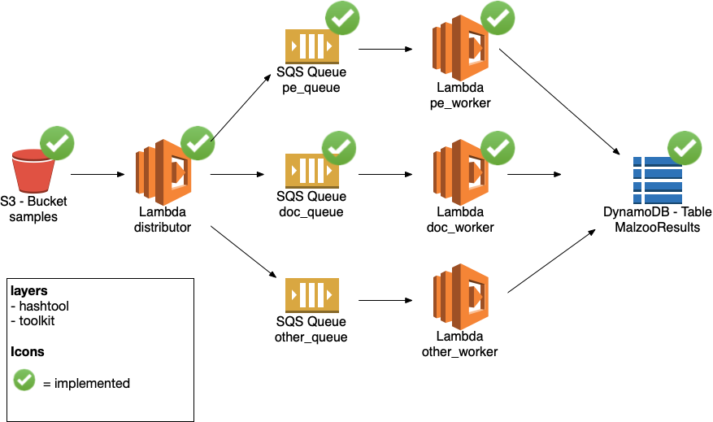

# Malzoo Serverless
### Description
Serverless implementation of the [Malzoo static file analyzer project](https://github.com/nheijmans/malzoo/)

The goal is to have a deployment-ready application template for mass static file analysis that everyone can use.
The architecture is kept simple and similar to the original Malzoo project, with a distributor and workers dedicated to a certain filetype.

### Credits
Thanks at @marekq for working together on the SAM deployment template!

### Contribute
If you have a cool feature build for one of the workers or a new worker, feel free to submit a PR! Please include a good description on what is been added and how it benefits the platform :) 
